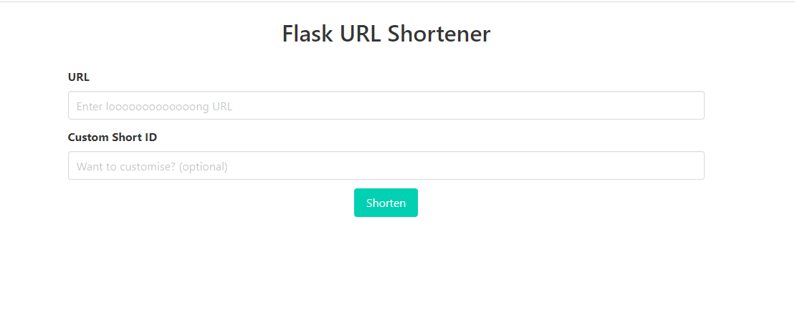

# Basic URL shortener using Flask Framework

Tool that takes any URL and generates a shorter, more readable version like bit.ly.

Reference: [freeCodeCamp!](https://www.freecodecamp.org/news/python-tutorial-how-to-create-a-url-shortener-using-flask)

## Install

Install with `pienv`:

```shell
pipenv install
```

## Screenshot

